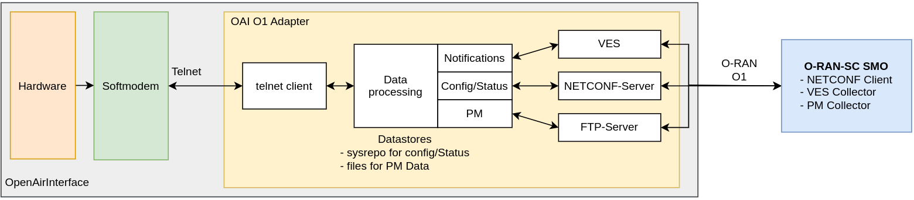
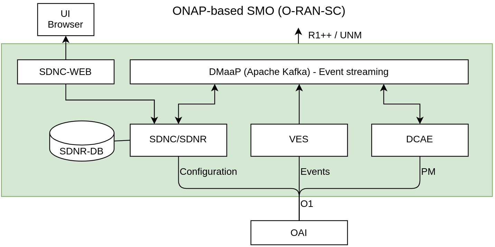

**Open Air Interface O1-Adapter**

**Table of Contents**

[[_TOC_]]

## Introduction

 "open air interface" refers to two related concepts in the telecommunications world:

1. **OpenAirInterface (OAI):** This is a specific software platform developed by EURECOM, a European research institute. OAI is an open-source implementation of the LTE and 5G standards, allowing anyone to access, modify, and use the software for research and development purposes. It serves as a valuable tool for fostering innovation in mobile communication technologies.

2. **Open RAN Interface:** In a broader sense, "open air interface" can also refer to the general concept of open interfaces within the Open Radio Access Network (Open RAN) architecture. An Open RAN disaggregates the traditional cellular network infrastructure, allowing different vendors to supply various components like radios and baseband units. This approach fosters competition and innovation but requires standardized interfaces for these components to interoperate seamlessly.

The O1 Interface, as described previously, is a crucial example of such an open interface within the Open RAN architecture.

The code of "O1 Adapter" in this repository contains the implementation of O1 interface for OAI.

The "O1 Adapter" provides the NETCONF Server with related YANG models. It is based on Netopeer & Sysrepo, together with the "adapter" software used to implement parts of the model and coordinate telnet-reported data with O1 data.

**netopeer (server)** and **sysrepo (datastore)** work together as a **NETCONF server** duo:

* **netopeer:** provides NETCONF connectivity.
* **sysrepo:** securely stores and retrieves configuration data using YANG models.

This combination offers:

* **Standardized management:** Consistent approach across devices.
* **Secure communication:** Protects data with secure protocols.
* **Centralized data:** Single source of truth for configurations.

Netopeer and sysrepo provide a powerful and secure solution for managing network devices.

The Interface to OAI device is using the OAI Telnet interface.

The OAI Telnet interface provides **access** to control and monitor the OpenAirInterface (OAI) softmodem program. Brief summary of its functionalities:

* **Monitor:** Allows observing real-time information about the softmodem, such as:
    * Signal strength
    * Cell configuration
    * Resource utilization
* **Control:** Enables sending commands to modify various softmodem parameters like:
    * Cell configuration
    * Power levels
    * Operating modes
* **Debug:** Provides access to internal data for troubleshooting purposes.

## Repository Top Level Directory structure

Top level repository structure:

oai-adapters repo-root
 - **src**: adapter source code
 - **docker**: image creation
 - **dictionary**: alarm and PM XML documentation
 - **integration**: system integration and testing (SIT)
 - **readme-images**: images for README.md
 - *README.md*: this readme
 - *build.adapter.sh*: build adapter script
 - *start-adapter.sh*: start/stop adapter
 - *Makefile*: Execute build/integration tasks (GNU Make)

See chapter development for more detailed structure.

## Architecture

### Overview

The figure below depicts the OAI O1 Adapter with internal parts and external interfaces.

{width=80%}

For integration the O-RAN-SC SMO (ORAN Based) is used.

{width=70%}

### The O1 Interface in Open Radio Access Network

Within the Open Radio Access Network (ORAN) architecture, the O1 Interface serves as a **standardized and crucial communication channel**. It facilitates the **management and orchestration (O&M)** of Open RAN Managed Elements (MEs) by the Service Management and Orchestration (SMO) framework.

**Functional Scope:**

The O1 Interface enables the SMO to perform essential O&M activities on MEs, including:

* **Configuration Management:** Adding, modifying, or deleting configurations of connected MEs.
* **Fault, Configuration, Accounting, Performance, and Security (FCAPS) Management:** Monitoring and managing critical network aspects like faults, configurations, accounting data, performance metrics, and security.
* **Software Management:** Installing, upgrading, and managing software on individual MEs.
* **File Management:** Transferring and managing files on MEs as required for various functionalities.

**Connected Entities:**

* **O-RAN Managed Elements (MEs):** These encompass several network components crucial for operation, such as:
    * Open Central Unit (O-CU)
    * Open Distributed Unit (O-DU)
    * Open Radio Unit (O-RU)
    * Near-real-time Radio Intelligent Controller (near-RT RIC)
* **Service Management and Orchestration (SMO) framework:** This central entity acts as the control center, issuing commands and receiving information through the O1 interface to manage the entire Open RAN system.

**Technical Specifications:**

* **Protocols:** The O1 interface utilizes well-established and secure protocols such as Secure Shell (SSH), Transport Layer Security (TLS), and Network Configuration Protocol (NETCONF) for reliable communication.
* **Data Model:** The YANG data model provides a structured and standardized format for representing and managing configuration data exchanged through the O1 interface.

**In conclusion, the O1 Interface serves as a critical cornerstone within the ORAN architecture, enabling the centralized management and orchestration of Open RAN components by the SMO framework. This facilitates efficient network operation, maintenance, and optimization, ultimately contributing to a robust and reliable Open RAN ecosystem.**

### The OAI Telnet interface for O1

The OAI Telnet extension for O1 is providing specialized functionality for O1 NETCONF Server. Attributes are converted and prepared to the format and structure, required by related yang specification.
The groups of information are
  * Monitoring information
    * like Channel bandwidth, load for downlink and uplink, SSB Frequency,  ..
    * or number of active UEs for PM Data recording MeanActiveUeDl, MeanActiveUeUl, MaxActiveUeUl and MaxActiveUeDl
  * Alarm notifications, like connection state to OAI Telnet interface.

See for more details: [OAI getlab telneto1](https://gitlab.eurecom.fr/oai/openairinterface5g/-/blob/telnet-o1/common/utils/telnetsrv/DOC/telneto1.md)

### Mapping

#### Telnet to NETCONF Mapping

|Name  | Categ.    | JsonType | Description                                                |
| -- | -- | -- | -- |
| softmodem-o1adapter-connected| alarm|string| Softmodem connection state, Identifier:  node-id \\ Managed by o1-adapter. Reporting status of telnet tcp connection, CLEAR if connection up, MINOR of connection down|
| [dl:bwp3gpp:isInitialBwp](https://forge.3gpp.org/rep/sa5/MnS/-/blob/Rel-18/yang-models/_3gpp-nr-nrm-bwp.yang#L54) | config | boolean| Telnet type/yangtype: true/INITAL  false/OTHER [type IsInitialBwp](https://forge.3gpp.org/rep/sa5/MnS/-/blob/Rel-18/yang-models/_3gpp-nr-nrm-bwp.yang#L35)|
| [dl:bwp3gpp:numberOfRBs](https://forge.3gpp.org/rep/sa5/MnS/-/blob/Rel-18/yang-models/_3gpp-nr-nrm-bwp.yang#L84) | config | number | Ok |
| [dl:bwp3gpp:startRB](https://forge.3gpp.org/rep/sa5/MnS/-/blob/Rel-18/yang-models/_3gpp-nr-nrm-bwp.yang#L76) | config | number | Ok |
| [dl:bwp3gpp:subCarrierSpacing](https://forge.3gpp.org/rep/sa5/MnS/-/blob/Rel-18/yang-models/_3gpp-nr-nrm-bwp.yang#L61) | config | number | kHz,  yang: uint32 { range "15  30  60 120"; } \\ SoMo: 0: 15or60, 1: 30or120  (grep for name)|
| [ul:bwp3gpp:isInitialBwp](https://forge.3gpp.org/rep/sa5/MnS/-/blob/Rel-18/yang-models/_3gpp-nr-nrm-bwp.yang#L54) | config | boolean| Telnet type/yangtype: true/INITAL  false/OTHER [type IsInitialBwp](https://forge.3gpp.org/rep/sa5/MnS/-/blob/Rel-18/yang-models/_3gpp-nr-nrm-bwp.yang#L35)|
| [ul:bwp3gpp:numberOfRBs](https://forge.3gpp.org/rep/sa5/MnS/-/blob/Rel-18/yang-models/_3gpp-nr-nrm-bwp.yang#L84) | config | number | Ok |
| [ul:bwp3gpp:startRB](https://forge.3gpp.org/rep/sa5/MnS/-/blob/Rel-18/yang-models/_3gpp-nr-nrm-bwp.yang#L76) | config | number | Ok |
| [ul:bwp3gpp:subCarrierSpacing](https://forge.3gpp.org/rep/sa5/MnS/-/blob/Rel-18/yang-models/_3gpp-nr-nrm-bwp.yang#L61) | config | number | kHz,  yang: uint32 { range "15  30  60 120"; } \\ SoMo: 0: 15or60, 1: 30or120  (grep for name)|
| [nrcelldu3gpp:ssbFrequency](https://forge.3gpp.org/rep/sa5/MnS/-/blob/Rel-18/yang-models/_3gpp-nr-nrm-nrcelldu.yang#L304) |config | number | Ok |
| [nrcelldu3gpp:arfcnDL](https://forge.3gpp.org/rep/sa5/MnS/-/blob/Rel-18/yang-models/_3gpp-nr-nrm-nrcelldu.yang#L158) | config | number | Ok|
| [nrcelldu2gpp:bSChannelBwDL](https://forge.3gpp.org/rep/sa5/MnS/-/blob/Rel-18/yang-models/_3gpp-nr-nrm-nrcelldu.yang#L180) | config | number | MHz, Ok |
| [nrcelldu3gpp:arfcnUL](https://forge.3gpp.org/rep/sa5/MnS/-/blob/Rel-18/yang-models/_3gpp-nr-nrm-nrcelldu.yang#L166) | config | number | Ok |
| [nrcelldu3gpp:bSChannelBwUL](https://forge.3gpp.org/rep/sa5/MnS/-/blob/Rel-18/yang-models/_3gpp-nr-nrm-nrcelldu.yang#L351) | config | number | MHz, Ok |
| [nrcelldu3gpp:nRPCI](https://forge.3gpp.org/rep/sa5/MnS/-/blob/Rel-18/yang-models/_3gpp-nr-nrm-nrcelldu.yang#L145)| config | number | type int32 { range "0..1007"; }, Ok |
| [nrcelldu3gpp:nRTAC](https://forge.3gpp.org/rep/sa5/MnS/-/blob/Rel-18/yang-models/_3gpp-nr-nrm-nrcelldu.yang#L152) | config | number | [typedef Tac](https://forge.3gpp.org/rep/sa5/MnS/-/blob/Rel-18/yang-models/_3gpp-common-yang-types.yang#L517), Ok|
| frame-type | status | enum ["tdd","fdd"] | not used |
| band-number | status | number | |
| num-ues | status | number | Number of connected UEs (To cell or DU?) . See section "Performance Data (PM)"|
| ues | status | List<number> | |
| load | status | integer | Percentage number [0..100], reflecting downling load |
| ues-thp.rnti | status | List<uethp> | List with throughput status of UEs. Virtual class:uethp specified below. |
| uethp:rnti | status | Integer | UE is |
| uethp:dl | status | Integer | Downlink load in kbit/s |
| uethp:ul | status | Integer | Uplink load kbit/s |

*HINT*: links are to approximate line positions

#### Performance Data (PM)

  * PM are collected
     * in files, provided via FTP
     * Notification via VES if new file available.
     * Existing Files list can not be requested at the moment.
     * Notifications are running always after O1Adapter startup
  * 96 Files with 15 Minutes each XML-Files in 3GPP Format
     * Reference standardized PM values are listed here
       * 3gpp xsd definition, mostly key/value pairs
       * [3gpp measData.xsd](https://forge.3gpp.org/rep/sa5/MnS/-/blob/Rel-18/xsd/measData.xsd)

#### PM Mapping process

  * PM Value definitions
    * mapping from "num-ues" value to the the following values:
       * General: request *every second* the "num-ues" via telnet from the SoftModem
       * We assume(!) that each reported UE is active for DL and UL.
       * Filename: Prefix "pm", Include start time in NETCONF format ( `20170213T09:00:00Z`) extension "xml"
       * **process the values as follows**
           * starting every 15min bound to xx:00, xx:15, xx:30, xx:45.
           * The counters are reset with each start to 0
           * For each poll:
             * *`DRB.MeanActiveUeDl`*, *`DRB.MeanActiveUeUl`*
                * add the value to counter
                * after 900s (P15m) divide the sum by 900 and deliver the result to a file.
             * *`DRB.MaxActiveUeUl`*, *`DRB.MaxActiveUeDl`*
                * If the value delivered by telnet is greater than the existing value, update with the greater value.
                * After 900s (P15m) deliver the result to a file.
#### VES Notifications

VES messages are send to VES Collector of SMO.

References:
  * [O-RAN SC smo/ves Documentation](https://docs.o-ran-sc.org/projects/o-ran-sc-smo-ves/en/latest/index.html)
  * [ONAP VES](https://docs.onap.org/projects/onap-dcaegen2/en/latest/sections/apis/ves.html)
  * PM File Ready [PM File Ready](https://gerrit.o-ran-sc.org/r/gitweb?p=oam.git;a=blob;f=code/client-scripts-ves-v7/json/templates/stndDefined-r16-notify-file-ready.json)

### Dictionary

The alarms and performance measurements are documented in XML format that definition is available in a formalized way.

The format is specified by O-RAN Software community.

See directory "dictionary".

## Development

### Tools, versions and license

  * Development environment:
    - Docker: Docker version 25.0.3, build 4debf41
    - Docker Compose: Docker Compose version v2.23.0
    - OS: Ubuntu 22.02 under Docker
    - Compiler, Linker: gcc (Ubuntu 11.4.0-1ubuntu1~22.04) 11.4.0
    - make: GNU Make 4.3

  * License conditions:
    - libssh [LGPL](https://git.libssh.org/projects/libssh.git/tree/COPYING)
    - libyang [BSD-3](https://github.com/CESNET/libyang/blob/master/LICENSE)
    - sysrepo [BSD-3](https://github.com/sysrepo/sysrepo/blob/master/LICENSE)
    - libnetconf2 [BSD-3](https://github.com/CESNET/libnetconf2/blob/master/LICENSE)
    - netopeer2 [BSD-3](https://github.com/CESNET/netopeer2/blob/master/LICENSE)
    - curl [curl, BSD-3, BSD-4, ISC](https://github.com/curl/curl/tree/master/LICENSES)
    - cjson [MIT](https://github.com/DaveGamble/cJSON/blob/master/LICENSE)
    - libtelnet [public domain](https://github.com/seanmiddleditch/libtelnet/blob/develop/COPYING)
    - openssh | no sourcecode used, only binary [BSD-like](https://www.openssh.com/)
    - vsftpd | no sourcecode used, only binary [GPL2](https://github.com/dagwieers/vsftpd/blob/master/COPYING)


### Directory structure

```
adapter
├── docker                                  [Docker build related files]
│   ├── config                              [configurations]
│   │   ├── config.json                     [main configuration]
│   │   ├── pmData-measData.xml             [pmData template]
│   │   ├── ves-clear-alarm.json            [VES Clear Alarm template]
│   │   ├── ves-file-ready.json             [VES File Ready Notification template]
│   │   ├── ves-heartbeat.json              [VES Heartbeat template]
│   │   ├── ves-new-alarm.json              [VES New Alarm template]
│   │   ├── ves-pnf-registration.json       [VES pnfRegistration template]
│   │   ├── vsftpd.conf                     [configuration file for vsftp - pmData FTP server]
│   │   └── vsftpd.userlist                 [user list file for vsftp]
│   ├── Dockerfile.adapter                  [Dockerfile for building the production adapter]
│   ├── Dockerfile.dev                      [Dockerfile for building the development adapter]
│   └── scripts                             [aditional scripts used in the docker container]
│       ├── adapter_entrypoint.sh           [entrypoint used in the Docker image]
│       ├── get-yangs.sh                    [script to retrieve the YANG models from 3gpp]
│       ├── install-yangs.sh                [script to install YANG models]
│       ├── netconf_dep_install.sh          [script to install all the netconf dependencies]
│       ├── netconf_dep_install_test.sh     [script for testing]
│       └── servertest.py                   [test telnet server]
├── src                                     [source code folder]
│   ├── alarms                              [code handling alarms]
│   │   ├── alarms.c
│   │   └── alarms.h
│   ├── common                              [common code, handling logs, configs and common functionality]
│   │   ├── config.c
│   │   ├── config.h
│   │   ├── log.h
│   │   ├── utils.c
│   │   └── utils.h
│   ├── netconf                             [libyang and sysrepo related methods to ease coding]
│   │   ├── netconf.c
│   │   ├── netconf_data.c
│   │   ├── netconf_data.h
│   │   ├── netconf.h
│   │   ├── netconf_session.c
│   │   └── netconf_session.h
│   ├── oai                                 [structure and methods related to the communication between the adapter and gNB]
│   │   ├── oai.c
│   │   ├── oai_data.c
│   │   ├── oai_data.h
│   │   └── oai.h
│   ├── pm_data                             [pmData handling]
│   │   ├── pm_data.c
│   │   └── pm_data.h
│   ├── telnet                              [telnet client used to connect to gNB]
│   │   ├── telnet.c
│   │   └── telnet.h
│   ├── ves                                 [VES messages handling]
│   │   ├── ves.c
│   │   ├── ves.h
│   │   ├── ves_internal.c
│   │   └── ves_internal.h
│   ├── build.sh                            [script to build the code - can be replaced by a Makefile at a latter stage]
│   ├── gnb-adapter                         [binary output from building the code, used for debugging]
│   ├── log.log                             [log file, used for debugging]
│   └── main.c                              [main source file, here starts everything]
├── README.md
├── build-adapter.sh                        [script to build the Docker images]
└── start-adapter.sh                        [script to run the Docker containers]
```

### How to build

There are two methods for building and using the code.

The first method is manually building everything and using the adapter in a `native`, non-Dockerized environment, while the second, much simpler, builds a Docker container in which the adapter runs.

### Building the source code
*This method is to be used when no container will be used.*

Assuming that all the libraries are already installed into the system, building the source code requires running the `./build.sh` script from within the `src` folder.
The script requires and accepts *no* parameters, and will compile and build the entire code.

Required libraries:
- pthread
- libyang
- sysrepo
- curl
- telnet
- cjson

Some of the libraries already have their own dependencies, such as:
- libssh version 0.9.2
- libnetconf2

More information about building and installing dependencies can be found below.

### Building and installing dependencies
When opting for building and using the source code without a `Docker` container, one should follow the guidelines provided by the `Dockerfile.adapter` as for what tools and libraries are needed.

For building the binary, such examples include `libpcre2-dev`, `zlib1g-dev` and `libssl-dev`.

For running the binary with its NETCONF dependencies some tools are required, such as: `openssl`, `openssh-client`, `openssh-server` and `vsftpd`.

After all the dependencies are met, running the `netconf_dep_install.sh` script will automatically build install the following libraries (versions can vary upon update, but MAJOR must match):
- libssh v0.9.2
- libyang v2.1.30
- sysrepo v2.2.36
- libnetconf2 v2.1.28
- netopeer2 v2.1.49
- curl v7.87.0
- cJSON v1.7.16
- libtelnet v0.23

After building and installing dependencies, the YANG models must be retrieved and installed.

### Retrieving and installing the O1 YANG Models
Retrieving the O1 YANG models from 3GPP can be done using the `get-yangs.sh` script.

Once the YANG models are available the `install-yangs.sh` script will install them.

Installing the models must be done via such scripts because the script only installs the required models, not all of them and the install order is important.

### Running the adapter and the NETCONF server
As the `adapter-entrypoint.sh` script illustrates, two daemons must be run to allow an O1 NETCONF Server:
- netopeer2-server, which is the NETCONF server itself, with all the models installed
- gnb-adapter, which is the adapter that connects to gNB via telnet and handles NETCONF server's requests for data

The default netconf server timeout is 5 seconds, which is not enough for long requests, that's why the netopeer2-server must have `-t 60` parameter which changes the timeout to 60 seconds.

If the adapter is run in a daemon fashion, an external environment variable `TERM` needs to be set to `xterm-256color` because of the `telnet client` that is bundled in the adapter itself.

### Full building example
```
# installing packages depend on the Linux version; here Ubuntu 22.02 is used as reference, but packages can change
apt-get update
apt-get upgrade
apt-get install -y tzdata build-essential git cmake pkg-config unzip wget libpcre2-dev zlib1g-dev libssl-dev autoconf libtool
apt-get install -y --no-install-recommends psmisc unzip wget openssl openssh-client vsftpd openssh-server

# add netconf user
adduser --system netconf && echo "netconf:netconf!" | chpasswd

# configure netopeer2
/usr/local/share/netopeer2/merge_hostkey.sh
/usr/local/share/netopeer2/merge_config.sh

# build and install depenencies
./adapter/scripts/netconf_dep_install.sh
ldconfig

# get and install the yang models
./docker/scripts/get-yangs.sh
./docker/scripts/install-yangs.sh

# build the binary
cd ./adapter/src
./build
```

If there is any issue with the commands above, please consult `Dockerfile.adapter` for a more accurate building recipe.

### Building the container
Building the Docker container is very easy and handles all the steps presented above, while fully separating the adapter environment from the rest of the system.

To build the container the `build-adapter.sh` script is used. Accepted parameters are:
- `--dev` instructs the script to only build the development container. This container should not be used in production, as it contains several debugging tools and the disk space and resources used are not optimized.
- `--adapter` instructs the script to build the production adapter
- `--no-cache` instructs the `docker builder` not to use any of its cache

```
# To build the adapter using the Docker container, use:
./build-adapter.sh --adapter
```

The rest of the documentation assumes that the production Docker container will be used.

## Development test

### Running the container

The container can be started either from `start-adapter.sh` or using a `docker-compose.yaml` file.

When manually starting the container, one should use `./start-adapter.sh --adapter`. Other options present in the `start-adapter.sh` script are for development/debugging purposes and should not be used otherwise.

When opting for starting the container via `docker-compose` a sample YAML file can be:
```
version: '3'

services:
  adapter-gnb:
    container_name: adapter-gnb
    image: ${ADAPTER_REPOSITORY}/${ADAPTER_IMAGE}
    ports:
      - "${ADAPTER_NETCONF_PORT}:830"
      - "${ADAPTER_SFTP_PORT}:22"
    volumes:
      - ./.ftp:/ftp
```
This sample file starts the adapter and mounts local `.ftp` folder to the adapter, in order for any pmData to also be stored locally.

If one wants to dynamically provide other configuration to the adapter than the one it's being already in the container from the `docker build` process, several files can be externally mounted to override current configurations:
```
    volumes:
      - ./config/config.json:/adapter/config/config.json #will override the config file to a locally hosted one
```

Templates can also be overridden, though this practice is discouraged:
```
    volumes:
      - ./config/pmData-measData.xml:/adapter/config/pmData-measData.xml
      - ./config/ves-clear-alarm.json:/adapter/config/ves-clear-alarm.json
      - ./config/ves-file-ready.json:/adapter/config/ves-file-ready.json
      - ./config/ves-heartbeat.json:/adapter/config/ves-heartbeat.json
      - ./config/ves-new-alarm.json:/adapter/config/ves-new-alarm.json
      - ./config/ves-pnf-registration.json:/adapter/config/ves-pnf-registration.json

```

For more information please check the `docker-compose*.yaml` files within `integration`.

### Configuration
Configuration is done through the `config.json` file. A sample is provided:
```
{
    "log-level": 3,
    "software-version": "abcd",
    "network": {
        "host": "10.20.11.134",
        "username": "netconf",
        "password": "netconf!",
        "netconf-port": 1830,
        "sftp-port": 1222
    },

    "ves": {
        "template": {
            "new-alarm": "/adapter/config/ves-new-alarm.json",
            "clear-alarm": "/adapter/config/ves-clear-alarm.json",
            "pnf-registration": "/adapter/config/ves-pnf-registration.json",
            "file-ready": "/adapter/config/ves-file-ready.json",
            "heartbeat": "/adapter/config/ves-heartbeat.json",
            "pm-data": "/adapter/config/pmData-measData.xml"
        },

        "pnf-registration": true,
        "heartbeat-interval": 30,

        "url": "https://10.20.35.128:8443/eventListener/v7",
        "username": "sample1",
        "password": "sample1",

        "file-expiry": 86400,
        "pm-data-interval": 30
    },

    "alarms": {
        "internal-connection-lost-timeout": 3,

        "load-downlink-exceeded-warning-threshold": 50,
        "load-downlink-exceeded-warning-timeout": 30
    },

    "telnet": {
        "host": "10.20.11.134",
        "port": 9091
    },

    "info": {
        "gnb-du-id": 0,
        "cell-local-id": 0,
        "node-id": "gNB-Eurecom-5GNRBox-00001",
        "location-name": "MountPoint 05, Rack 234-17, Room 234, 2nd Floor, Körnerstraße 7, 10785 Berlin, Germany, Europe, Earth, Solar-System, Universe",
        "managed-by": "ManagementSystem=O-RAN-SC-ONAP-based-SMO",
        "managed-element-type": "NodeB",
        "model": "nr-softmodem",
        "unit-type": "gNB"
    }
}
```

Explanation for what each node is configuring:
```
{
    "log-level": 3,                 # configures the logging verbosity; between 0-3, 0 means less, 3 means more
    "software-version": "abcd",     # configures adapter version to be reported further
    "network": {                    # configures adapter network information, which is reported further for pnfRegistation (and other purposes)
        "host": "10.20.11.134",     # hostname/IP (externally available) of the host machine where the container runs
        "username": "netconf",      # netconf username; should be in conjuncture to what credentials were provided in the Dockerfile for building
        "password": "netconf!",     # netconf password; should be in conjuncture to what credentials were provided in the Dockerfile for building
        "netconf-port": 1830,       # netconf external port mapped on the host machine
        "sftp-port": 1222           # sftp external port mapped on the host machine
    },

    "ves": { # VES configuration
        "template": {               # VES templates; self explanatory and discouraged to be modified from here
            "new-alarm": "/adapter/config/ves-new-alarm.json",
            "clear-alarm": "/adapter/config/ves-clear-alarm.json",
            "pnf-registration": "/adapter/config/ves-pnf-registration.json",
            "file-ready": "/adapter/config/ves-file-ready.json",
            "heartbeat": "/adapter/config/ves-heartbeat.json",
            "pm-data": "/adapter/config/pmData-measData.xml"
        },

        "pnf-registration": true,   # enables or disables VES pnfRegistration
        "heartbeat-interval": 30,   # VES heartbeat interval, in seconds; set to 0 to disable

        "url": "https://10.20.35.128:8443/eventListener/v7",    # VES collector endpoint
        "username": "sample1",  # VES collector username
        "password": "sample1",  # VES collector password

        "file-expiry": 86400,   # pmData file retention policy, in seconds
        "pm-data-interval": 30  # pmData polling interval, in seconds
    },

    "alarms": {                                             # alarms configuration
        "internal-connection-lost-timeout": 3,              # timeout, in seconds, between the moment when the telnet connection is lost and the moment an alarm is raised; if connection goes back on in this timeout period, no alarm is raised

        "load-downlink-exceeded-warning-threshold": 50,     # threshold for when to fire the alarm based on the "load" parameter
        "load-downlink-exceeded-warning-timeout": 30        # timeout for load-downlink-exceeded-warning; applies on both raising and clearing the alarm
    },

    "telnet": {                     # gNB telnet server credentials, self explanatory
        "host": "10.20.11.134",
        "port": 9091
    },

    "info": {                           # information used in the NETCONF data, not provided by the telnet server
        "gnb-du-id": 0,                 # gNB DU Id
        "cell-local-id": 0,             # Cell Local Id
        "node-id": "gNB-Eur.....",      # Node Id
        "location-name": "Mount...",    # gNB Location (text)
        "managed-by": "Managem...",     # managed-by text
        "managed-element-type": "NodeB",# managed element type
        "model": "nr-softmodem",        # model
        "unit-type": "gNB"              # unit type
    }
}
```

### How to connect via O1

Using any NETCONF client, one should connect to adapter by simply connecting on the corresponding host/IP address and port.

The server is 100% compliant to the NETCONF protocol and should be able to exchange messages with any NETCONF client.

## System Integration and Testing (SIT)

System and integration testing verify that the individual software components work together seamlessly as a whole system. 

It can be also used as template for demo setups.

Please refer to [integration/README.md](integration/README.md)

## Appendix

### References

  * [1] OpenAirInterface license: https://openairinterface.org/legal/oai-license-model/
  * [2] OpenAirInterface git: https://gitlab.eurecom.fr/oai/openairinterface5g
  * [3] O-RAN-SC license: https://docs.o-ran-sc.org/en/latest/license.html
  * [4] O-RAN-SC Architecture: https://docs.o-ran-sc.org/en/e-release/architecture/architecture.html
  * [5] libyang source code and documentation: https://github.com/CESNET/libyang.git
  * [6] sysrepo source code and documentation: https://github.com/sysrepo/sysrepo.git
  * [7] libnetconf2 source code and documentation: https://github.com/CESNET/libnetconf2.git
  * [8] netopeer2 source code and documentation: https://github.com/CESNET/netopeer2.git
  * [9] curl/libcurl source code and documentation: https://github.com/curl/curl.git
  * [10] cJSON source code and documentation: https://github.com/DaveGamble/cJSON.git
  * [11] libtelnet source code and documentation: https://github.com/seanmiddleditch/libtelnet.git
  * [12] O-RAN Alliance: https://www.o-ran.org/
  * [13] ONAP Home: https://www.onap.org/
  * [14] IETF RFC6241 NETCONF: https://datatracker.ietf.org/doc/html/rfc6241
  * [15] IETF RFC6020 YANG: https://datatracker.ietf.org/doc/html/rfc6020
  * [16] ONAP VES: https://wiki.onap.org/display/DW/VES+7.1
  * [17] OpenAirInterface: https://openairinterface.org/

### Terms

  * O-RAN: Open RAN Alliance
  * O-RAN-SC: O-RAN Software Community
  * OAI: OpenAirInterface
  * ONAP: Open Network Automation Platform
  * SMO: Service Management and Orchestration