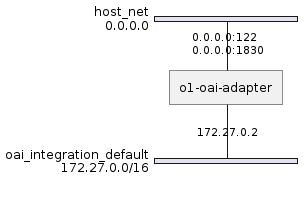
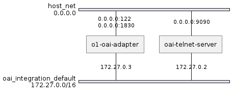
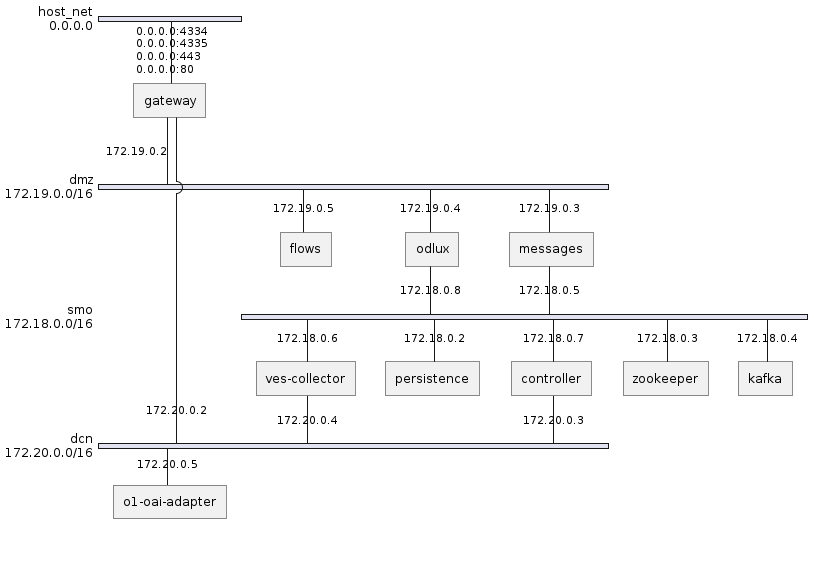

# Integration

Several deployment solutions can be used for integration purposes:

- deploy o1-oai-adapter standalone
- deploy o1-oai-adapter with a telnet test server
- deploy o1-oai-adapter with SMO provided by O-RAN-SC
- deploy o1-oai-adapter with SMO provided by O-RAN-SC a telnet test server

## Standalone o1-oai-adapter

Copy [config.json.template](config/config.json.template) and add/modify required data (most important configuration):

```
cp integration/.env.template integration/.env 
```

| Path | default | Comment | 
|----------|----------|----------|
| OAI_OAI_ADAPTER_HOST | host IP address | add adapters FQDN/IP address reachable from SMO |
| VES_COLLECTOR_URL | https://ves-collector.dcn.smo.o-ran-sc.org/eventListener/v7 |add SMO ves-collectors FQDN/IP |
| OAI_OAI_TELNET_HOST | host IP address |telnet IP/FQDN for oai-gnb |
| OAI_TELNET_PORT | 9000 |telnet port for oai-gnb |

Run the o1-oai-adapter:
```
make run-o1-oai-adapter
      
```



## o1-oai-adapter with telnet test server


```
make run-o1-adapter-telnet 
```


## O1-oai-adapter with SMO

First SMO will be deployed from O-RAN-SC community gerrit.

```
cp integration/.env.template integration/.env 
```
Modify values if required:

| Value | Default | Description |
| ------- | ------- | ------- |
| ADMIN_PASSWORD | admin | admin password set for ODLUX GUI |
| HTTP_DOMAIN | smo.o-ran-sc.org | domain FQDN, please chek setting in adapter config file |
| SDNC_IMAGE | nexus3.onap.org:10001/onap/sdnc-image:2.7.0-STAGING-latest| ONAP SDNC image |
| SDNC_WEB_IMAGE | nexus3.onap.org:10001/onap/sdnc-web-image:2.7.0-STAGING-latest| ONAP SDNC web-image |
| HOST_IP | result of $(shell hostname -I\|cut -d' ' -f1) | host IP, change e.g. if VM has an external IP |
| ENABLE_OAUTH | false | in this setup keycloak ist not deployed |

Add further  environment variables for SMO if a change is required.

```
make run-o1-oai-adapter-smo
```


Hint: This configuration works only with VES messages if oai gnb with telnet interface is deployed and configured.

## o1-oai-adapter with SMO and telnet test server

adjust `.env` file as for other sections above

```
make run-o1-oai-adapter-smo-telnet
```


  * O-RAN: Open RAN Alliance
  * O-RAN-SC: O-RAN Software Community
  * OAI: OpenAirInterface
  * ONAP: Open Network Automation Platform
  * SMO: Service Management and Orchestration

## Teardown deployment

Any o1-oai-adapter deployment can be stopped:

```
make teardown
```

## Trigger alarm notification via telnet server

Some alarm situations can be simualted with telnet test server

- change to directory
```
cd integration
```

- trigger connection alarm

```
docker compose stop oai-telnet-server 
sleep 40
docker compose start oai-telnet-server 

```

- trigger threshold alarm

```
env OAI_CURRENT_LOAD=60 docker compose -f docker-compose-telnet.yaml up -d

```
- trigger threshold clear alarm

```
env OAI_CURRENT_LOAD=12 docker compose -f docker-compose-telnet.yaml up -d

```

